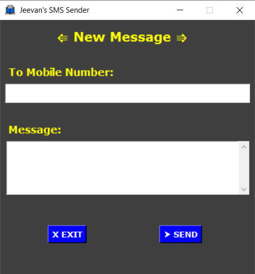

# SMS-Sender-Using-Tkinter-GUI

#### Imported the required libraries
= > `requests` library is one of the integral part of Python for making HTTP requests to a specified URL. Requests is an Apache2 Licensed HTTP library, that allows to send HTTP/1.1 requests using Python.

= > `json` The full-form of JSON is JavaScript Object Notation. It means that a script (executable) file which is made of text in a programming language, is used to store and transfer the data.

= > `tkinter` It is a standard Python interface to the Tk GUI toolkit shipped with Python. Python with tkinter is the fastest and easiest way to create the GUI applications. The Tkinter tkMessageBox has various methods to display a message box.

I have used fast2sms as my API for sending SMS and there are many other API's for sending SMS.

You can send SMS to multiple mobile numbers seperated by comma like: "8888888888,9999999999,6666666666"

